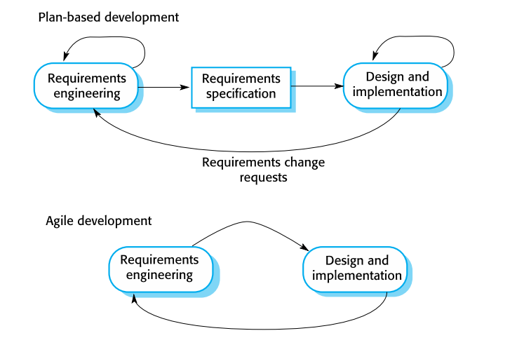

# 1ª Frequência de MDS

## Tópicos

- [1ª Frequência de MDS](#1%c2%aa-frequ%c3%aancia-de-mds)
  - [Tópicos](#t%c3%b3picos)
  - [Processos de Software](#processos-de-software)
    - [Modelos de Processos de Software](#modelos-de-processos-de-software)
      - [Modelo Waterfall (Cascata)](#modelo-waterfall-cascata)
        - [->Etapas Waterfall](#etapas-waterfall)
        - [->Desvantagens Waterfall](#desvantagens-waterfall)
        - [->Problemas Waterfall](#problemas-waterfall)
        - [->Utilizacao Waterfall](#utilizacao-waterfall)
      - [Modelo Incremental](#modelo-incremental)
        - [->Vantagens Incremental](#vantagens-incremental)
        - [->Problemas Incremental](#problemas-incremental)
        - [->Integracao e Configuracao Incremental](#integracao-e-configuracao-incremental)
        - [->Tipos de componentes disponiveis Incremental](#tipos-de-componentes-disponiveis-incremental)
      - [Modelo baseados em reutilizacao](#modelo-baseados-em-reutilizacao)
        - [Integracao e configuracao](#integracao-e-configuracao)
          - [->Etapas do Processo](#etapas-do-processo)
          - [->Vantagens](#vantagens)
          - [->Desvantagens](#desvantagens)
  - [Engenharia de Requisitos](#engenharia-de-requisitos)
    - [Requisitos](#requisitos)
      - [O que sao requisitos](#o-que-sao-requisitos)
      - [Tipos de requisitos](#tipos-de-requisitos)
      - [System stakeholders](#system-stakeholders)
      - [Requisitos funcionais](#requisitos-funcionais)
      - [Requisitos nao funcionais](#requisitos-nao-funcionais)
  - [Processos Engenharia de Requisitos](#processos-engenharia-de-requisitos)
    - [Identificacao dos Requisitos](#identificacao-dos-requisitos)
      - [Problemas na Identificacao dos Requisitos](#problemas-na-identificacao-dos-requisitos)
      - [Processo de identificacao e analise de requisitos](#processo-de-identificacao-e-analise-de-requisitos)
    - [Cenarios](#cenarios)
    - [Especificacao de requisitos](#especificacao-de-requisitos)
      - [Formas de escrever os requisitos](#formas-de-escrever-os-requisitos)
      - [Requisitos e desenho do sistema](#requisitos-e-desenho-do-sistema)
      - [Especificação em língua natural](#especifica%c3%a7%c3%a3o-em-l%c3%adngua-natural)
      - [Escrita dos requisitos – Guião](#escrita-dos-requisitos-%e2%80%93-gui%c3%a3o)
      - [Problemas da Linguagem Natural](#problemas-da-linguagem-natural)
      - [Especificações estruturadas](#especifica%c3%a7%c3%b5es-estruturadas)
      - [Espeicificações baseadas em formulários](#espeicifica%c3%a7%c3%b5es-baseadas-em-formul%c3%a1rios)
      - [Especificação tabular](#especifica%c3%a7%c3%a3o-tabular)
      - [Use Cases](#use-cases)
      - [Documentos de requisitos](#documentos-de-requisitos)
      - [Validação dos requisitos](#valida%c3%a7%c3%a3o-dos-requisitos)
      - [Gestão dos requisitos](#gest%c3%a3o-dos-requisitos)
  - [UML - Introdução](#uml---introdu%c3%a7%c3%a3o)
    - [O que é?](#o-que-%c3%a9)
    - [Tipos de utilização](#tipos-de-utiliza%c3%a7%c3%a3o)
    - [UML as Sketch](#uml-as-sketch)
      - [Forward Engineering](#forward-engineering)
      - [Reverse Engineering](#reverse-engineering)
      - [Ferramentas](#ferramentas)
    - [UML as Blueprint](#uml-as-blueprint)
      - [Detalhar um sistema](#detalhar-um-sistema)
      - [Forward Engineering](#forward-engineering-1)
      - [Reverse Engineering](#reverse-engineering-1)
      - [Ferramentas](#ferramentas-1)
    - [UML as programming language](#uml-as-programming-language)
      - [Problemas](#problemas)
    - [Conceptual and software modeling](#conceptual-and-software-modeling)
    - [Notações e meta-modelos](#nota%c3%a7%c3%b5es-e-meta-modelos)
    - [Diagramas UML](#diagramas-uml)
    - [UML válido](#uml-v%c3%a1lido)
    - [UML e processos de desenvolvimento](#uml-e-processos-de-desenvolvimento)
      - [Análise de requisitos](#an%c3%a1lise-de-requisitos)
      - [Design](#design)
      - [Documentação](#documenta%c3%a7%c3%a3o)
  - [Use Cases](#use-cases-1)
    - [O que sao](#o-que-sao)
    - [Cenarios](#cenarios-1)
    - [Engenharia de requisitos](#engenharia-de-requisitos-1)
    - [Elementos básicos](#elementos-b%c3%a1sicos)
    - [Conteudo de um Use Case](#conteudo-de-um-use-case)
    - [Cada Use Case](#cada-use-case)
    - [Como identificar atores](#como-identificar-atores)
    - [Identificar Guidelines](#identificar-guidelines)
    - [Diagrama de Use Cases](#diagrama-de-use-cases)
      - [Atores](#atores)
      - [Use Cases](#use-cases-2)
      - [Associações](#associa%c3%a7%c3%b5es)
    - [Outras utilizações](#outras-utiliza%c3%a7%c3%b5es)
    - [Importante](#importante)
  - [Diagramas de Classes](#diagramas-de-classes)
    - [Análise Conceptual](#an%c3%a1lise-conceptual)
    - [Diagramas de Classes](#diagramas-de-classes-1)
    - [Classes](#classes)
      - [Propriedades](#propriedades)
    - [Associações / Relações (23)](#associa%c3%a7%c3%b5es--rela%c3%a7%c3%b5es-23)
      - [Atributos](#atributos)
      - [Atributos e Associações](#atributos-e-associa%c3%a7%c3%b5es)
    - [Multiplicidade](#multiplicidade)
    - [Associações bidirecionais](#associa%c3%a7%c3%b5es-bidirecionais)
    - [Operações](#opera%c3%a7%c3%b5es)
    - [Dependências](#depend%c3%aancias)
    - [Restrições](#restri%c3%a7%c3%b5es)
    - [Responsabilidades](#responsabilidades)
    - [Operações e atributos estáticos](#opera%c3%a7%c3%b5es-e-atributos-est%c3%a1ticos)
    - [Propriedades derivadas](#propriedades-derivadas)
    - [Interfaces e Classes Abstratas](#interfaces-e-classes-abstratas)
  - [Diagramas de Iteração](#diagramas-de-itera%c3%a7%c3%a3o)
    - [Diagramas de Sequências](#diagramas-de-sequ%c3%aancias)
    - [Diagramas de comunicação](#diagramas-de-comunica%c3%a7%c3%a3o)
    - [Sequência vs comunicação](#sequ%c3%aancia-vs-comunica%c3%a7%c3%a3o)
  - [Diagrama de Atividades](#diagrama-de-atividades)
    - [Partições](#parti%c3%a7%c3%b5es)
  - [Desenvolvimento Ágil de Software](#desenvolvimento-%c3%81gil-de-software)
    - [Planos e métodos ágeis](#planos-e-m%c3%a9todos-%c3%a1geis)
  - [Desenvolvimento ágil de Software](#desenvolvimento-%c3%a1gil-de-software)
    - [Extreme Programming](#extreme-programming)
    - [XP e métodos ágeis](#xp-e-m%c3%a9todos-%c3%a1geis)
    - [Refactoring](#refactoring)
    - [Automatação de Testes](#automata%c3%a7%c3%a3o-de-testes)
    - [Gestão de projetos ágeis](#gest%c3%a3o-de-projetos-%c3%a1geis)
      - [Scrum](#scrum)

## Processos de Software

- Conjunto de atividades usado para desenvolver software.

### Modelos de Processos de Software

- Modelo Waterfall (cascata)
- Modelo Incremental
- Integração e configuração

#### Modelo Waterfall (Cascata)

**[`^        para cima        ^`](#)**

- Baseado em planos.

##### ->Etapas Waterfall

- Análise e especificações de requísitos;
- Desenho do software;
- Implementação e testes unitários;
- Integração e testes de Sistema;
- Operação e manutenção.

##### ->Desvantagens Waterfall

- Dificuldade em incluir alterações depois de dar início ao

##### ->Problemas Waterfall

- Divisão inflexível do projeto em diferentes etapas;
- Dificulta a resposta a alteração de requisitos;
- Os requisitos devem se bem conhecidos;
- Poucos sistemas tem requisitos estáveis.

##### ->Utilizacao Waterfall

- Para sistemas grandes;
- Desenvolvido para equipas grandes.

#### Modelo Incremental

**[`^        para cima        ^`](#)**

##### ->Vantagens Incremental

- Custos para incluir alterações de requisitos é reduzido;
  - Menos análise e documentação.
- Mais fácil obter feedback do client relativo ao desenvolvimento que está a ser feito
  - Os clientes podem analisar demos do software e perceber o que já se encontra implementado.
- Entrega e deployment mais rápido de software utilizável.

##### ->Problemas Incremental

- Processo não é visível
  - Difícil medir o progresso.
    - Software desenvolvido de forma rápida.
- Estrutura do software degrada-se a cada incremento
  - Incorporar novas funcionalidades torna-se cada vez mais difícil

##### ->Integracao e Configuracao Incremental

- Baseado na utilização do software;
- Elementos reutilizáveis podem ser configuráveis.

##### ->Tipos de componentes disponiveis Incremental

- Web services;
- Coleções de objetos.

#### Modelo baseados em reutilizacao

**[`^        para cima        ^`](#)**

##### Integracao e configuracao

###### ->Etapas do Processo

- Especificação de requísitos;
- Pesquisa e análise de software;
- Alteração / Adaptação de requísitos;
- Configuraçãp das aplicações do sistema;
- Adaptação e integração de componentes

###### ->Vantagens

- Custos e riscos reduzidos;
  - Menos software é criado de raiz.
- Enregas e deployments do sistema mais rápido.

###### ->Desvantagens

- Compromissos com os requisitos;
- Não existe controle sobre a evolução dos componentes reutilizados.

**[`^        para cima        ^`](#)**

## Engenharia de Requisitos

**[`^        para cima        ^`](#)**

### Requisitos
**[`^        para cima        ^`](#)**

#### O que sao requisitos

- Descrições do sistema;
- Restrições do sistema;
- Identificados durante o processo de engenharia de requisitos.

#### Tipos de requisitos

- Requisitos do Utilizador
  - Frases escritas em língua natural;
  - Diagramas de serviços do sistema;
  - Restrições de utilização/operação;
  - Escritos para os clientes;

**Ex**: “O sistema deve gerar relatórios mensais com o custo dos medicamentos receitados por cada
clínica, durante o mês em questão”.

- Requisitos do Sistema
  - Documento estruturado;
  - Descrições detalhadas das funcionalidades do sistema e dos serviços;
  - Restrições de utilização/operação;
  - Define o que deve ser implementado;

**Ex**: “No último dia de cada mês, deve ser feito um gerado um relatório com todos os medicamentos
receitados, o seu custo e a clínica que os receitou.”

#### System stakeholders

- Qualquer pessoa
  - que esteja relacionada com o sistema;
  - que tenha algum interesse no sistema.

-Tipos de stakeholders
  - Utilizadores finais;
  - Gestores do sistema;
  - Donos do sistema;
  - Stakeholders externos;

#### Requisitos funcionais

- Descrevem as funcionalidades do sistema

- Dependem de:
  - Tipo de software;
  - Utilizadores do sistema;
  - Tipo do sistema onde o software vai ser usado.

- Requisitos funcionais de utilizador;
  - Descrições de alto-nível sobre o que o sistema deve fazer.
- Requisitos funcionais do sistema:
  - Descrição detalhada sobre os serviços do sistema

- Devem ser consistentes e “completos”;
- Completos, incluir todas as descrições;
-Consistentes, não existir conflitos ou contradições.

#### Requisitos nao funcionais

- Definem propriedades e restrições ao sistema.
  - **Ex:** fiabilidade, tempo de resposta requisitos de storage, dispositivos de I/O, etc.
- Requisitos ssobre o processo de Software
  - **Ex:** uso de um IDE específico, de uma linguagem ou de um método de desenvolvimento
- Podem ser mais críticos que os funcionais
- Podem afetar o sistema de forma global

Tipos:

- Requisitos do produt
  - Requisitos que especificam qual o comportamento do sistema
- Requisitos organizacionais
  - Requisitos que resultam das politicas e procedimentos da organização/empresa
- Requisitos externos
  - Requisitos relacionados com factores externos ao sistema

## Processos Engenharia de Requisitos

- Variam dependendo de:
  - Domínio de aplicação;
  - Pessoas envolvidas;
  - Entidade que desenvolve os requisitos;

### Identificacao dos Requisitos
**[`^        para cima        ^`](#)**
- Descoberta de requisitos;
- Trabalho conjunto da equipa técnica com os clientes por forma a descobrir:
  - o domínio da aplicação;
  - os serviços que devem ser fornecidos;
  - restrições de operação/utilização;
- Pode envolver todos os stakeholders:
  - Utilizadores finais;
  - Gestores;
  - Engenheiros envolvidos na manutenção

#### Problemas na Identificacao dos Requisitos

- Stakeholders não sabem o que realmente querem;
- Stakeholders expressam os requisitos nos seus termos próprios;
- Diferentes stakeholders podem ter requisitos com conflitos;

#### Processo de identificacao e analise de requisitos

1. Descoberta dos Requisitos
  - Interagir com todos os stakeholders por forma a descobrir os requisitos
  - Requisitos de domínio são também identificados
  - Fazer a distinção entre requisitos de utilizador e de sistema

2. Clarificação e organização dos requisitos
  - Agrupar requisitos relacionados
  - Organizá-los em conjuntos coerentes

3. Priotarizaçãp e negociação do requisitos
  - Atribuir prioridades
  - Resolver conflitos entre requisitos

4. Especificação de requisitos
  - Escrita dos requisitos

### Cenarios

**[`^        para cima        ^`](#)**

- User story estruturada;
- Devem incluir:
  - Descrição da situação inicial (ou ponto de partida);
  - Descrição do fluxo normal de eventos;
  - Descrição do que pode correr mal;
  - Informação sobre outras atividades concorrentes;
  - Descrição do estado do sistema quando o cenário termina.

### Especificacao de requisitos

- Processo de escrever os requisitos
  - requisitos de sistema e de utilizador
  - documento de requisitos
- Os requisitos devem ser de fácil compreensão
- Os requisitos devem ser detalhados
- Os requisitos devem ser o mais completo possiveis

#### Formas de escrever os requisitos

- Em linguagem natural.
- De forma estruturada
- Com anotações gráficas
- Com especificações metemáticas

#### Requisitos e desenho do sistema

- Preferencialmente 
  - Especificam o que o sistema deve fazer;
  - Descreve como é feito.

- Na prática, requisitos e desenho são inseparáveis
  - A arquitetura do sistema pode ser desenhada para estruturar os requisitos

#### Especificação em língua natural

- Requisitos são escritos em língua natural, complementados com diagramas e tabelas;

- A linguagem natural é:
  - Expressiva
  - Intuitiva

#### Escrita dos requisitos – Guião

- “Criar” um formato standard para todos os requisitos;
- Usar linguagem de forma consistente:
  - Usar “deve” para requisitos obrigatórios
  - Usar “pode” para requisitos desejáveis
- Usar text highlight para identificar aspetos importantes do requisito
- Evitar termos técnicos;
- Explicar o porque do requisito

#### Problemas da Linguagem Natural

- Falta de clareza
- Confusão de requisitos, os requisitos funcionais e nao funcionais misturam-se entre si;
- Junção dos requisitos

#### Especificações estruturadas

- Abordagem para escrever requisitos:
  - Liberdade limitada para descrever os requisitos;
  - Escritos seguindo um padrao espeicfico.

- Funciona bem para alguns tipos de sistema

#### Espeicificações baseadas em formulários

- Definição da funcionalidade ou entidade;
- Descrição dos inputs e qual a sua origem;
- Descrição dos outputs e qual o seu destino;
- Informação sobre a dados/informação e outras entidades necessárias;
- Descrição das ações a serem tomadas;
- Pré e pós condições (se existirem);
- Efeitos secundários (se existirem);

#### Especificação tabular

- Usada para complementar a língua natural;
- Útil

#### Use Cases

- Tipo de cenários:
  - Fazem parte do UML

- Identificam:
  - Atores;
  - Numa interação com o sistema

- Modelo gráfico de alto nível:
  - Complementado com uma descrição tabular

- Diagrama de sequências (UML):
 Podem ser usados para detalhar os use cases;

#### Documentos de requisitos

- Documento oficial que indicia à equipa de desenvolvimento o que é esperado do sistema;
- Deve incluir a definição dos requisitos de utilizador bem como os requisitos do sistema;
- Deve dizer o que o sistema deve fazer

Formato: 

- Não existe um formato único
- Informação no documento de requisitos depende do tipo de sistema a ser desenvolvido e da
abordagem de desenvolvimento
- Sistemas desenvolvidos de forma incremental, tipicamente, têm um documento de requisitos
menos detalhado

- Existem alguns standards para o documento de requisitos
  - IEEE
  - Usados apenas a projetos grandes

#### Validação dos requisitos

- Demonstrar que os requisitos definem o sistema que se pretende implementar;

- Como validar
  - Validade dos requisitos;
  - Consistência;
  - Completude;
  - Realismo;
  - Verificabilidade;

#### Gestão dos requisitos

- Processo de gerir as alterações dos requisitos durante todo o processo
  - Aparecimento de novos requisitos;
  - Gerir dependências entre requisitos;

- Estabelecer um processo formal
  - efetuar alterações nos requisitos
  - estabelecer ligações entre requisitos

## UML - Introdução

**[`^        para cima        ^`](#)**

### O que é?

- Linguagem de modelação gráfica
- Descrever e desennhar sistemas de software

### Tipos de utilização

- Depende do utilizador
- Esboço (sketch)
- Blueprint (detalhar um sistema)

### UML as Sketch

- Descrever detalhes de um sistema
- Nível de abstração elevado
- Tipo de utilização (Forward e Reverse Engineering)

#### Forward Engineering

- Desenhar um diagrama antes de escrever código;
- Discutir ideia e alternativas com a equipa
- Focar no importante
- Não pensar em código

#### Reverse Engineering

- Desenhar o diagrama depois de existir código
- Usar os sketches para explicar partes do sistema
- Usar a documentação do sistema como complemento

#### Ferramentas

- Simples
- Criar diagramas UML (informal)

### UML as Blueprint

**[`^        para cima        ^`](#)**

#### Detalhar um sistema

- De forma exaustiva
- Tipo de utilização
  - Forward Engineering
  - Reverse Engineering

#### Forward Engineering

- Modelo detalhado (sistemas e partes do sistema)
- Completo (especifica decisões)
- Programador segue o modelo
- Designer -> modelo da interface do sistema
- Programador -> detalhes internos do sistema

#### Reverse Engineering

- Informação detalhada de parte do código de um sistema

#### Ferramentas

- Mais complexas
- Forward Engineering (Criar diagramas UML)
- Reverse engineering
  - Analisam códio fonte
  - Geram diagrams UML

### UML as programming language

**[`^        para cima        ^`](#)**

- Maior quantidade de modelos UML
  - Programção mais mecânica
  - UML para programar
- Programadores
  - Usam diagramas UML (que é o source code)
  - Compilados diretamente
- Ferramentas muito mais complexas e sofisticadas
- Model Driven Architecture (MDA)
  - Abordagem para se usar UML (como linguagem de programação)
  - Confunde-se com UML (apenas usa UML como linguagem base dos modelos)
- Abordagem MDA
  - Trabalho dividido em duas áreas
    1. PIM (Plataform Independent Model)
      - Representação do Sistema
      - Independente da plataforma
      - UML
    2. PSM (Plataform Specific Model)
      - Representação do sistema
      - Dependente da plataforma
      - Um para cada platafora/tecnologia
      - Pode ser UML
  - Modelo PIM transformado em PSM (ferramentas específicas)
  - Modelo PSM transformado em código (pode ser automatizado)

- Executable UML
  - Parecido com MDA
    - Modelos independentes da plataforma (parecidos com os modelos PIM de MDA)
    - Model Compiler
      - Compila o modelo incial
      - Sistema executável
      - Num único passo
      - Não necessita dos PSM (Plataform Specific Models)
    - Subset do UML
      - Não usa todas as características do UML
      - Mais simples do que UML

#### Problemas

- Ferramentas
  - Maturo
- Produtividade
  - Executable UML

### Conceptual and software modeling

**[`^        para cima        ^`](#)**

- Perspetiva de software
  - Elementos UML
    - Mapeados diretamente para elementos de software
- Perspetiva conceptual
  - Elementos UML
    - Descrição de conceitos de uma aplicação
    - Não são elementos de software
    - Vocabulário de um domínio específico

### Notações e meta-modelos

**[`^        para cima        ^`](#)**

- UML define:
  - Notações
    - Elementos dos modelos
    - Sintaxe gráfica da linguagem de modelação
  - Meta-modelo
    - Define conceitos da linguagem
  - Linguagens gráficas
    - Pouco Rigor
    - Muito informal, mas útil
  - Importância do Meta-Modelo
    - Depende da utilização
    - Sketching
    - Blueprinting
    - UML as programming language

### Diagramas UML

**[`^        para cima        ^`](#)**

- UML define:
  - Actividades
  - Classes
  - Objectos
  - Sequência
  - Estado máquina
  - Casos de Uso

### UML válido

**[`^        para cima        ^`](#)**

- O que é?
  - O que está definido como bem formado na sua especificação
- Na prática
  - Muito complexo
  - Aberto a várias interpretações
  - Tem diferentes utilizações
- Importância
  - Sketching ou blueprinting
    - Pode ser usado
    - Pouco importante
    - Mais importante, implica m melhor design
  - UML as programming language
    - Essencial ou não funcionará corretamente

### UML e processos de desenvolvimento

**[`^        para cima        ^`](#)**

#### Análise de requisitos

- Use cases: Descrevem como é que os utilizadores interagem com o sistema
- Diagrama de classes: Usando uma perspetiva conceptual, podem ser usados para construir um vocabulário sobre o domínio do sistema
- Diagrama de atividades: Workflow/fluxo de trabalho na empresa, mostrando como é que o software interage com atividades humanas. Mostrar o contexto dos use cases, bem como detalhes de use cases complexos.
- Diagramas de estados: Se o sistema tiver um life cycle interessante, com diferentes estados e eventos que fazem mudar o estado

#### Design

- Diagrama de classes: a partir de uma perspetiva do software. Podem mostrar classes do sistema e como estão interligadas.
- DIagramas de sequências: Workflow/fluxo de trabalho na empresa, mostrando como é que o software interage com atividades humanas. Mostrar o contexto dos use cases, bem como detalhes de use cases complexos.
- Diagramas de estados: Se o sistema tiver um life cycle interessante, com diferentes estados e eventos que fazem mudar o estado

#### Documentação

- Package diagram: mapa lógico do sistema
- Diagramas de classes: apenas os aspetos importantes de cada package
- Diagramas de interação: ajudar a compreender alguns aspetos dos diagramas de classes
- Máquinas de estados: ajudar a perceber o ciclo de vida das classes, apenas para classes mais complexas

## Use Cases

**[`^        para cima        ^`](#)**

### O que sao

- Técnicas para capturar requisitos funcionais
- Descrevem interações entre Utilizadores e Sistema
- Mostram como o sistema é usado

### Cenarios

- Descrição de uma utilização do sistema
  - Sequência de passos
  - Descrevem a interação entre o utilizador e o sistema

- Use case
  - Conjunto de cenários que são relacionados entre si através de um objetivo comum

### Engenharia de requisitos

- Deve responder às perguntas:
  - O sistema a desenvolver serve para que?
  - Deve fazer o que?
- Para quem?

### Elementos básicos

- Atores
  - Utilizadores do sistema (que interage com o sistema)
- Use Cases
  - Oferecidadas aos atores

### Conteudo de um Use Case

- Cenário principal de sucesso
  - Caso normal
  - Descritos através de uma sequência de passos numerados
- Outros cenários alternativos
  - Extensões
  - Descritos através de variações do cenário principal

### Cada Use Case

**[`^        para cima        ^`](#)**

- Tem um ator principal
  - Invocar o Use Case para ter acesso ao serviço
  - Ator que tem como objetivo
    - o que o Use Case satisfaz
    - normalmente, é quem inicia o Use Case

- Podem existir outros atores (atores secundários)

- Cada passo/etapa
  - Representa uma interação entre o ator e o sistema
  - Frases simples
  - Descrever forma clara quem executa o passou ou etapa
  - Deve perguntar o que pode correr de forma diferente ou correr mal.

- Cada extensão
  - Descreve uma alternativa ao caso normal
  - Descreve uma condição
  - Descreve quais as diferenças para o cenário principal

- Como descrever uma extensão
  - Começar indicar qual o passo do cenário principal que dá origem à extensão
  - Continuar com a lista de passos
  - No final, indicar para onde se deve continuar

- Excelente ferramenta para fazer brainstorming

- Perceber quais as condições das extensões, só depois pensar nos detalhes de cada uma.

- Caso seja um passo/etapa complexo, pode ser outro use case

- Pode incluir(slide 15 UML-Use Cases)
  - Pré-condições
  - Garantias
  - Trigger

### Como identificar atores

**[`^        para cima        ^`](#)**

- Quem vai beneficiar com o sistema?
- Quem está interessado em certo requisito do sistema?
- Onde, na organização, é que o sistema é usado?
- Quem vai fornecer a informação ao sistema, quem vai usá-la, quem vai retirá-la?
- O sistema usa algum recurso externo?
- Existe alguém que tenha diferentes papéis (responsabilidades)?
- Existem diversas pessoas com o mesmo papel? Ou parecidos?

### Identificar Guidelines

- Bem definida
- Deve dar origem a “um resultado”
- Não deve ser demasiado abstrata (ou de alto nível)
- Não deve ser demasiado específica (ou de baixo nível)

### Diagrama de Use Cases

- Mostram
  - Relações entre Atores e Use Cases
  - Que atores invocam quais Use Cases
  - Que Use Cases usam outros Use Cases
  - Fronteira do sistema
- Relações entre Use Cases
  - include ou uses
  - extends
  - herança

#### Atores

**[`^        para cima        ^`](#)**

- Não fazem parte do system
- São representados no system
- São cruciais para a análise

#### Use Cases

- descrevem as grandes funcionalidades dos atores
- devem “dar” um resultado observável e útil para um ator
- um use case especifica o comportamento do sistema (ou parte do sistema)
- traduz-se num conjunto de sequências de ações (incluindo variantes)

#### Associações

- Relações entre:
  -  Atores, Atores
  -  Atores, Use Cases
  -  Use Cases, Use Cases

- Uma associação entre um ator e um Use Case indica que há comunicação entre eles e pode existir o envio/receção de mensagens

- Tipos de Associações:
  - Normais (entre Atores e Use Cases)
  - Include ou Uses (entre Use Cases)
  - Extend (entre Use Cases)
  - Herança (entre Atores e/ou Use Cases)

- `<<include>> ou <<uses>>`
  - Representar comportamento comum entra\

- `<<extend>>`
  - representa
    - variantes
    - opções
    - exceções

- Generalizações/especializações
  - herança
  - aplicável a use cases e atores
  - são particularizações
  - possui as mesmas propriedades duma relação pai/filho

### Outras utilizações

- Ajudam a conceber e validar a arquitetura do sistema
- Podem ser uma base para os testes do sistema;
- São um “ponto de referência” em todas as etapas de desenvolvimento

### Importante

**[`^        para cima        ^`](#)**

- Os Use Cases descrevem um sistema a um nível (muito) elevado de abstração
- Não se diz como serão implementados
- É uma disciplina de análise difícil
- É fácil resvalar para a tecnologia
- É fácil descer de nível de abstração
- Cuidado com as especializações, extends e include/uses

## Diagramas de Classes

**[`^        para cima        ^`](#)**

- Conceito bases
  - Representa o essencial e é usado em todos os tipos de diagrama de classes.
  - Nem sempre são necessários.

- Processo de desenvolvimento:
  - Análise/levantamento de requisitos;
  - **Análise conceptual**;
  - Desenho;
  - Implementação;
  - Testes;

### Análise Conceptual

- use cases (ponto de vista utilizador)
- classes e relações (estrutura dos “dados”)
- interações (modelação dos processos)
- constraints (restrições, regras de negócio)

### Diagramas de Classes

**[`^        para cima        ^`](#)**

- Classes: "coisas" do problema
  - Identidade;
  - atributos;
  - operações
- Descrevem:
  - Tipos de objetos no sistema
  - Relações que existem entre objetos
- Indica:
  - Propriedades das classes
  - Operações dos objetos

- Interessa para o meu sistema?
  - sim, é um ator importante

- Vou guardar informação sobre ele?
- depende
- preciso?
  - “dará” origem a uma classe
- não preciso?
  - não “dará” origem a uma classe

### Classes

**[`^        para cima        ^`](#)**

#### Propriedades

- Elementos estruturais de uma classe
- “Tipicamente” são “campos/atributos” de uma classe
- Conceito único (duas notações distintas)
- Possíveis notações:
  - Atributos
  - Associações
  - Embora pareçam diferentes, são o mesmo

### Associações / Relações (23)

**[`^        para cima        ^`](#)**

#### Atributos

- Podem ser entre classes
- Pode ser recursivas (sobre a própria classe)

#### Atributos e Associações

- Quando usar Atributos ou Associações?
  - Na teoria: são “equivalentes”
- Regra geral
  - Usar atributos:
    - Tipos de dados simples
    - **Ex:** Datas, booleanos, inteiros, etc…
  - Usar associações:
    - Tipos de dados complexos
    - Classes importantes do problema
    - **Ex:** cliente, encomenda, etc...

### Multiplicidade

**[`^        para cima        ^`](#)**

- Indica quantos objetos podem pertencer uma propriedade
- Possibilidades
  - Limite inferior
    - >= 0
  -  Limite superior
     - >0 ou *(ilimitado)
  - Limite inferior == limite superior
    - Pode usar-se apenas um nº: 1 .. 1 → 1
  - Caso especial
    - * → 0 .. *

- Nos atributos
  - Opcional
    - Limite inferior: 0
  - Obrigatório
    - Limite inferior: >= 1
  - Singlevalued
    - Limite superior: 1
  - Multivalued
    - Limite superior: >1, normalmente *

### Associações bidirecionais

- Duas propriedades relacionadas
  - “seguir” as propriedades em qualquer sentido

### Operações 

- Ações feitas por uma classe
- Métodos de uma classe

### Dependências

- Dependências entre dois elementos
  - Um “cliente” e um “fornecedor”
  - Se a alteração da definição de um elemento (“fornecedor”)
    - implicar alterações de outro elemento (“cliente”)

- Quando pode existir dependência
  - Uma classe envia uma “mensagem” a outra;
  - Uma classe “tem” outra classe como parte dos seus dados;
  - Uma classe “menciona” outra através de parâmetros ou atributos;
  - Se uma classe muda o seu interface, qualquer classe que “comunica” com ela, pode deixar de conseguir comunicar

- Importância
  - Crescimento do sistema
    - Maior complexidade
    - Maior rede de dependências
    - Gestão/controlo de dependências
      - Previne “alguns” problemas inerentes à alteração dos sistemas
- Em UML
  - Dependências entre qualquer tipo de elementos
  - Usadas para mostrar quando alterações num elemento, podem provocar alterações noutro elemento

- Implícitas em
  - Associações “navegáveis”
  - Generalizações

- Regras
  - Minimizar dependências
  - Cuidado com dependências cíclicas
  - Incluir/“mostrar” apenas dependências importantes nos diagramas

### Restrições

**[`^        para cima        ^`](#)**

- Diagramas de Classes
  - Estrutura do problema
  - Especificam restrições globais do sistema
    - Que elementos, como são compostos, quais as suas relações
    - Não conseguem especificar todas as restrições
  - Restrições (Constraint Rules)
    - Qualquer tipo de restrição sobre o sistema
      - Linguagem natural
      - Linguagem de programação
      - UML Object Constraint Language (OCL)
    - Representado como uma “nota”
      - Restrição coloca-se entre { }

### Responsabilidades

- Algo que um objeto/entidade deve fazer
- É responsável por fazer determinada operação/tarefa

### Operações e atributos estáticos

- Operações e atributos de classes “normais”
  - Aplicam-se a uma instância/objeto da classe
  - Dependem do objeto
  - Não fazem sentido sem um objeto

- Operações e atributos de classe estáticos
  - Referem-se à classe e não aos objetos
  - São independentes dos objetos
  - Diagrama de classes
    - Representados com um sublinhado

### Propriedades derivadas

- Calculadas com base noutras propriedades
- Quando usar
  - Uma propriedade que deriva de outras
  - Forma de especificar uma “restrição” entre valores

### Interfaces e Classes Abstratas

- Classe abstrata
  - Classe que não pode ser instanciada
  - Instancia-se uma sub classe
- Interface abstrata
  - Classe sem implementação
  - Todos os elementossão abstratos

## Diagramas de Iteração

**[`^        para cima        ^`](#)**

- Descrevem
  - colaboração entre vários objetos
  - num determinado comportamento
- UML fornece vários diagramas de interação
  - Diagramas de sequência
  - Diagramas de colaboração

- Diagramas de interação
  - Descrevem/capturam o comportamento
  - Num único cenário de utilização
    - Conjunto de objetos
- Diagramas de sequência
  - Focam-se no tempo
  - Ordenação temporal das mensagens
- Diagramas de comunicação
  - Ou diagramas de colaboração (UML 1.x)
  - Focam-se na organização dos objetos e nos dados

### Diagramas de Sequências

- Mostram
  - Interação entre participantes numa operação/cenário
  - Mensagens entre participantes
  - Focam-se no tempo

- Diferenças entre os dois cenários
  - Forma como os participantes interagem entre si

- Controlo centralizado vs distribuído
  - Centralizado (feito no mesmo local)
  - Distribuído (distribuido por todos os participantes)
    - Preferível
    - “Junta” dados com comportamentos
    - Muito “orientado a objetos”

- Mensagens síncronas e assíncronas
  - Síncronas (Necessita de esperar pela mensagem)
  - Assíncrona (Não precisa de esperar por uma resposta)
    - Usadas tipicamente em sistemas multi-thread

### Diagramas de comunicação

- Foco nos links de dados entre os participantes
- Participantes
- Links
  - Entre os participantes
  - Mostram como cada participante se liga a outro
  - Podem representar
    - Instâncias de associações entre classes
    - Links transientes
- Mensagens entre os participantes
  - Usando os links
  - Numerar as mensagens, para saber a sequência correta

### Sequência vs comunicação

- “Equivalentes entre si”
  - A partir de um, consegue-se chegar ao outro
  - Diagramas de comunicação não têm notação para lógica de controlo
- Sequência
  - Usar quando se quer focar a sequência de chamadas
- Comunicação
  - Quando se quer focar a ligação entre os participantes
  - Bom para explorar diferentes alternativas

## Diagrama de Atividades 

**[`^        para cima        ^`](#)**

- Comportamento do sistema
- Modelação dinâmica do sistema
- Modelar/descrever
  - Lógica procedimental
  - Processos de negócio
  - Fluxos de trabalho
- Semelhantes aos fluxogramas
- Representam atividades
  - Transições entre atividades (quando e porquê)
- Caso “particular de estado”
  - Estados que correspondem a atividades, ações ou operações

### Partições 

- Diagramas de atividades mostram o que acontece
  - Mas não mostram quem faz o quê
- Partições
  – Dividir o diagrama de atividades
  – Mostrar quem faz o quê
  - Swim lanes

## Desenvolvimento Ágil de Software

**[`^        para cima        ^`](#)**

- Desenvolvimento e entrega rápida do software é muito importante
  - Os requisitos alteram-se rapidamente (vantagens);
  - Dificl produzir um conjunto de requisitos estaveis (Desvantagens);
- Especificação, desenho e implementação estão intercaladas.
- São desenvolvidos com várias versões.
- Entregas constantes de novas versões (avaliação)

### Planos e métodos ágeis

- Desenvolvimento baseado em planos:
  - Etapas de desenvolvimento separadas.
    - Output de cada etapa é planeamento com antecedência
  - Pode não ser o modelo **Waterfall** .
    - É possível que também para ser o **incremental**, baseado em planos.
- Métodos Ágeis
  - Especificação, desenho, implementação e testes (intercalados)
  - Foco no código
  - Redução na documentação
  - Resposta de forma rápida à alteração de requisitos

## Desenvolvimento ágil de Software

**[`^        para cima        ^`](#)**

### Extreme Programming

- Várias versões por dia;
- Incrementos são entregues aos clientes frequentemente;
- Testes devem ser executados antes de fazer uma nova versão

### XP e métodos ágeis

- Defende que não se deve antecipar alterações;
- Propõem melhorias constantes ao código.

### Refactoring

- Procura de possivéis melhorias no software;
- Melhora a compreensão de software;
- Alteração mais fáceis de fazer dado que o código está bem estruturado.

### Automatação de Testes

- Testes escritos como componentes executáveis
- Antes da implementação das funcionalidasds
- Testes devem:
  - ser isolados/stand-alone
  - invocar a funcionalidade a ser testada
  - verificar se o output está de acordo com as especificações

### Gestão de projetos ágeis

**[`^        para cima        ^`](#)**

#### Scrum

- Método ágil de desenvolvimento de software
  - Planeamento geral do processo;
  - Estabelecer objetivos do projeto e deesenhar e arquitetura de software.
- Spint cycles:
  - Em cada ciclo é desenvolvido parte do sistema
- Fim do projeto:
  - Termina documentação necessária;
  - Avaliar todos os aspetos do projeto.
- Benefícios:
  - Produto partido em partes mais pequenas e fácil compreensão
  - Requisitos não estáveis não afetam o projeto
  - Toda a equipa tem visibilidade sobre todo o projeto.
- Problemas:
  - Muito Informal;
  - Desenhados para equipas pequenas. 